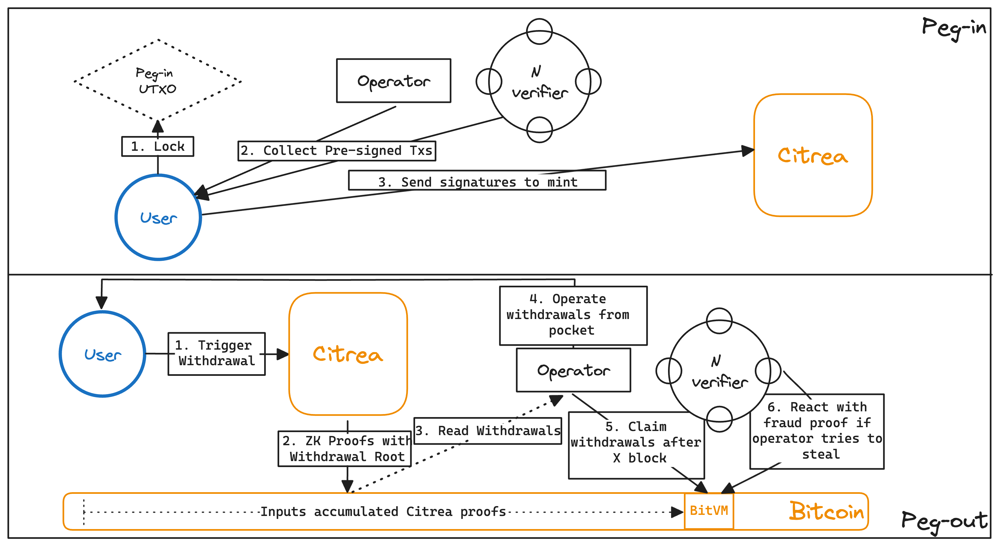

# Bitcoin Settlement: Trust-minimized BTC Bridge

<figure><figcaption>
Trust-minimized two-way peg in Citrea
</figcaption></figure>

Citrea light client proofs are natively verified in Bitcoin, thanks to BitVM. We have implemented a multi-verifier BitVM setup where an operator is responsible for peg-in and peg-out transactions and verifiers are in charge of checking invalid peg-in and peg-out transactions. Any invalid transaction can be challenged by verifiers. **As long as one verifier is honest, the peg is secure.** This is a great improvement over the existing insecure bridge constructions that mostly depend on the honest majority assumption within a closed or open federation.

There are no delays on withdrawals once the proof is finalized on Bitcoin in the optimistic case. The operator does the withdrawals from its own pocket. Later, it claims the pegged-out BTC from the BitVM program with a proof showing that all the withdrawals from the canonical Citrea chain have been done on Bitcoin. If there is any fraud in the process, any verifier among set of N reacts with a fraud proof on Bitcoin, slashing prover's stake and keeping the peg secure.

## What the BitVM Contract Verifies

* Recursively-merged Light Client proofs with deposit and withdrawal roots.
* Bitcoin Header Chain proof showing the latest Bitcoin block header as well as a merkle tree of all the previous headers (similar to [ZeroSync](https://zerosync.org/) header chain proofs).
* Bitcoin SPV proofs showing that all the withdrawals are covered by the operator from its own pocket.

In order to reduce the program size committed on Bitcoin (and thus the fraud proof size), all of the above logic is enshrined in two Groth16 circuits. The BitVM program is actually a single Groth16 verifier, hardcoded with the circuit's verifying key.

The operator provides the proof off-chain first. If everyone agrees its correct, the on-chain footprint is minimal - N/N signatures. If a verifier thinks there is a fraud, a challenge-response game starts between the verifier and operator. Eventually the loser's deposit gets slashed. If an operator is malicious, it will be removed from the committee and replaced by other pre-determined operator.

### Technical Limitations

* Peg-in and peg-out amount is fixed and a relatively large number.
  * In order to keep the pre-signed tx amount manageable, Citrea will start with a fixed and large amount as peg-in/out amount.
  * To improve the UX, users can collectively sign PSBTs on Bitcoin to peg-in and also collectively send withdrawal requests on Citrea.
  * To improve the UX further, Citrea will develop a trustless atomic swap protocol between Bitcoin and Citrea to employ $BTC/$cBTC swaps.

The design and architecture of the two-way peg is ready and under heavy development. The two-way peg does **not** require any network change and is trust-minimized. In order to make settlements of Citrea fully trustless, there needs to be opcode change(s). Please refer to the Future Research section for more information.
