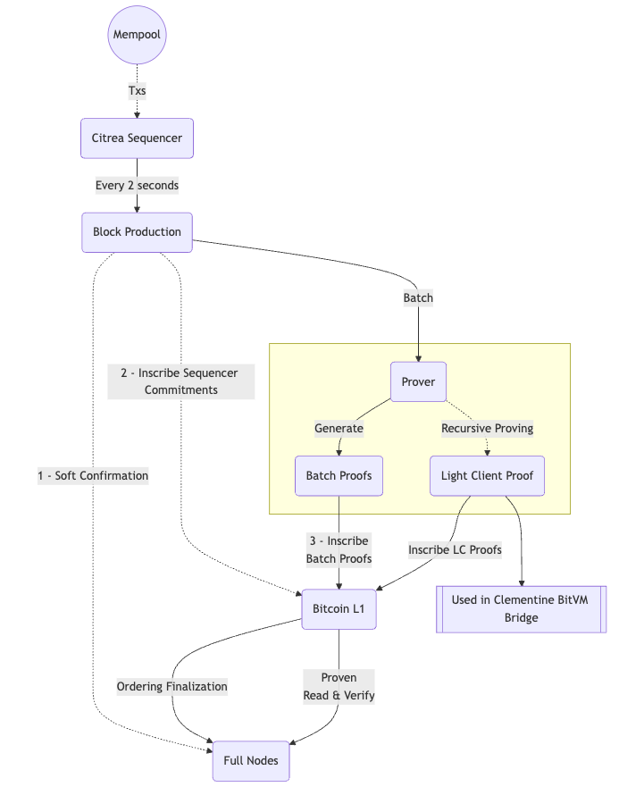

# Block Production

This section details Citrea's block production and finalization process, from transaction submission to confirmation. It covers the roles of the sequencer, commitments, mempool, and overall process. 

#### Components Overview

You can read more on each component of the block production process with detailed explanation below:

- [Mempool](./mempool.md): A holding area for user transactions before they are included in a block.
- [Sequencer](./sequencer.md): A special full node that orders the transactions, produces rollup blocks, and publishes commitments to the Bitcoin DA.
- [Sequencer Commitments](./sequencer-commitments.md): Cryptographic commitments to the Citrea blocks that are inscribed on Bitcoin by the sequencer to prevent reorgs.
- [Soft Confirmations](./soft-confirmations.md): A confirmation mechanism used by the sequencer to provide soft-finality of blocks.

#### Block Production Process

Here is a diagram that shows process & components of block production in Citrea. Feel free to check each component above for more detailed information in the diagram.

<figure><figcaption>
Extended Block Production
</figcaption></figure>

In short, block production in Citrea is as follows:
- User transactions enter the mempool where they undergo some checks until they are included in a block.
- The sequencer selects valid transactions from the mempool, orders them, and produces a rollup block.
- The sequencer also provides soft confirmations alongside the block data, allowing full nodes to update their local chain state with a soft-finality.
- To finalize the ordering of the transactions, sequencer commitments are inscribed on Bitcoin by the sequencer, allowing full nodes to trustlessly verify the blocks.
- Lastly, the proving of execution is completed by the prover and batch proofs are inscribed (and finalized) on Bitcoin, and hence block becomes finalized & proven.
