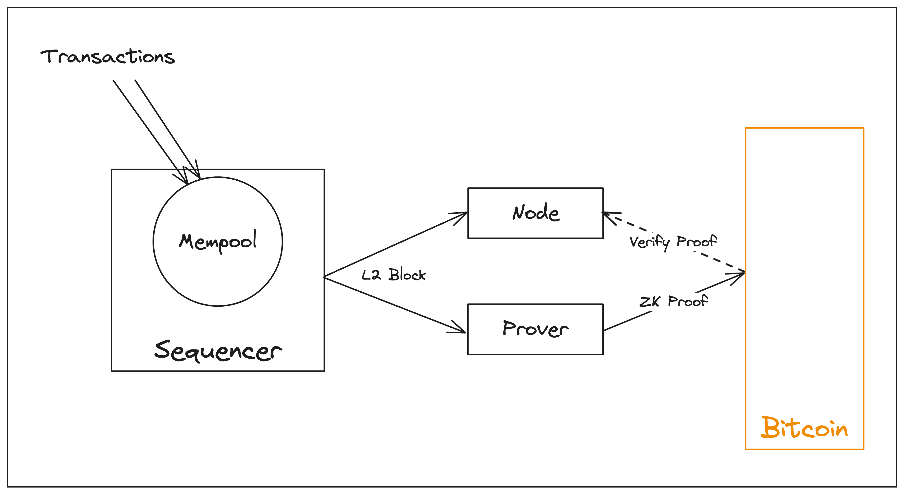

# Block Production

This section details how Citrea produces blocks. 

In short, user transactions on Citrea are submitted to the mempool, then ordered and included in a block by the sequencer. The sequencer produces blocks every two seconds, broadcasts them to full nodes, and issues to soft confirmation to full nodes. This process allows full nodes to update the local chain state.

Soft confirmations provided by the sequencer provide a soft-finality. For true finalization, the sequencer commitments and later the batch proofs (generated by the prover) are inscribed on Bitcoin, allowing full nodes to trustlessly access and verify them.

<figure><figcaption>
Simplified Block Production in Citrea
</figcaption></figure>

You can read more on each component of the block production process with detailed explanation below:

- Mempool: A temporary storage area for user transactions before they are included in a block.
- Sequencer: A special full node that orders the transactions, produces rollup blocks, and publishes commitments to the Bitcoin blockchain.
- Sequencer Commitments: Cryptographic commitments to the Citrea blocks that are inscribed on Bitcoin by the sequencer.

