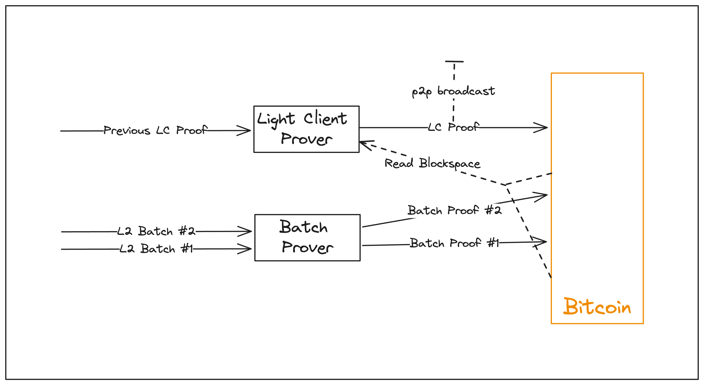

# Proof Generation

<figure><figcaption>
Proof Generation in Citrea
</figcaption></figure>

Citrea's proof generation mechanism is specialized for Bitcoin and BitVM. Citrea is running on top of a recursion-capable STARK-based zkVM, RISC Zero, and utilizes two different types of proofs:&#x20;

* **Batch Proof:** Batch proofs are produced for every few Bitcoin blocks. The Citrea batch proof circuit is configured to scan Bitcoin blocks for batch root inscriptions via inclusion and soundness proofs, and if any exist, it inputs the L2 batch that results in the batch root and proves the validity of the L2 batch. The proof outputs state difference resulting from the batch, initial and latest state roots, and the blockhash of Bitcoin block scanned. The proof with outputs is inscribed in Bitcoin.&#x20;
* **Light Client Proof:** Light client proofs recursively validate batch proofs and provides a single proof for full rollup history, allowing trustless and instant light clients. Light client proof circuit inputs the previously generated light client proof, an array of batch proofs with their inclusion and soundness proofs, and an array of Bitcoin block headers corresponding to the inscribed batch proofs. The circuit recursively verifies every single batch proof and the light client proof, asserts the latest state root of the proof N-1 is equal to initial state root of the proof N. This logic ensures that no state transition is skipped, thus the end result is the same state root with the actual rollup state root.
  * Light client proofs can be generated at any time by recursively verifying the previous light client proof with the batch proofs.
  * Light client proofs are broadcasted in the peer-to-peer network and also inscribed in Bitcoin.
  * Light nodes can listen to the peer-to-peer network or only track the latest Bitcoin headers, and the latest proof they find verifies the full rollup history and provides a trustless access to the state root.

The Citrea circuit mainly proves two different pieces of logic; execution and blockspace. During the batch proof generation, both execution and blockspace are proven. During the light client proof generation, blockspace and verification of batch proofs are proven.

* **Execution proving:** Citrea runs the state transition function of the rollup, which is slightly broader logic that includes the EVM, inside the zk circuit. The circuit inputs the pre-state of the rollup, the new batch of blocks, and outputs the state difference between the pre and post-state after applying the batch.
* **Blockspace proving:** Blockspace proving is a brand new concept used in Citrea. Blockspace proving logic is a custom zk circuit that scans a Bitcoin block, extracts the state roots or Citrea batch proofs and forced transactions from it. In batch proofs it asserts the state root's accuracy and in light client proofs it verifies the batch proofs (if one exists). Bitcoin block scanning inside the circuit is being done by the inclusion and soundness proof given, and checked against the corresponding Bitcoin block header.

Citrea merges execution proving and blockspace proving inside a single circuit for batch proofs. Individual batch proofs are only helpful for full nodes. In order to run a light node on batch proof only system, the light node must check every Bitcoin block one by one for proofs, which is not feasible for a light client because of the bandwidth and storage requirements involved.

In Citrea, thanks to its light client proofs which apply recursion over batch proofs and blockspace proofs, users have trustless light clients. Anyone with the last few Bitcoin blocks or connection to the peer-to-peer network can extract the Citrea light client proof and be sure that it represents the only valid fork of the chain and validates every state transition since Citrea's genesis block.
